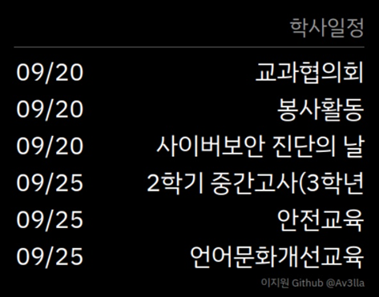

# School Schedule Module


[](https://mit-license.org/)

### Magic Mirror Module

A module for the [MagicMirror](https://github.com/MichMich/MagicMirror) to display a *school schedule* using data from [Korea Ministry of Education](https://open.neis.go.kr/).

---

* ## Preview


---

* ## Usage
    You need to install and configure the module for your MagicMirror.

    ### Setup
    Clone the module into your modules folder.
    ```shell
    cd ~/MagicMirror/modules && git clone https://github.com/Av3lla/school-schedule-module
    ```
    ### [* Folder name issue](#known-issues)

    ### Configuration

    Add the module configuration to your `config.js` file.

    ```js
    {
    	module: 'SchoolSchedule',
    	position: 'bottom_right',
    	config: {
            key: 'ApiKey',
            schoolName: 'SchoolName',
            updateInterval: '1000 * 60 * 60'
    	}
    },
    ```

    | Option | Description | Default | Required |
    |---|---|---|---|
    | `key` | the API key from OpenWeatherMap.| `null` | O |
    | `schoolName` | the name of school you want to get schedule from. | `null` | O |
    |`loadDates`| the number of days to load | `7` | O |
    | `maxIndex` | limit the maximum number of schedules to be displayed | `7` | O |
    | `updateInterval` | change the update period in Milliseconds. | `1000*60*60` | X |

---

### NOTE

#### Known Issues
  * You Need to change the *folder name* from `school-schedule-module` to `AirPollution`.